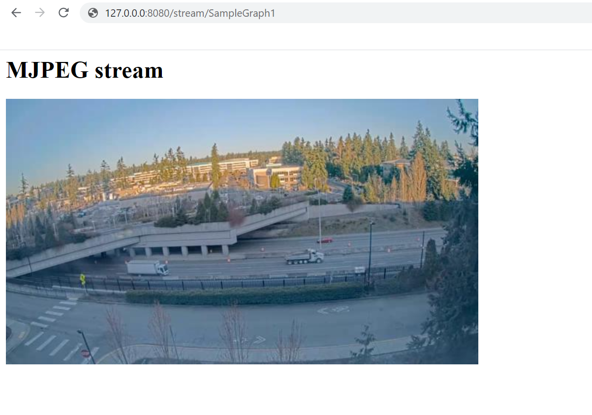

# GStreamer with video analytics plugins from Intel DL Streamer

The following instructions will enable you to build a Docker container with a [gRPC](https://grpc.io/) server that can receive messages from LVA on IoT Edge module, and use a [GStreamer](https://gstreamer.freedesktop.org/) pipeline with video analytics plugins from [DL Streamer](https://github.com/opencv/gst-video-analytics) [OpenVINO Toolkit](https://software.intel.com/en-us/openvino-toolkit) (licensed under MIT license).

Additional open source technologies included are [Yolov3](http://pjreddie.com/darknet/yolo/) [ONNX](http://onnx.ai/) model using [nginx](https://www.nginx.com/), [gunicorn](https://gunicorn.org/), [flask](https://github.com/pallets/flask), [runit](http://smarden.org/runit/), and [pillow](https://pillow.readthedocs.io/en/stable/index.html).

## Contributions needed

* Improved logging

## Prerequisites

1. [Docker](https://docs.docker.com/docker-for-windows/wsl/) installed on your dev machine.
2. [Visual Studio Code](https://code.visualstudio.com/) with [Azure IoT Tools extension](https://marketplace.visualstudio.com/items?itemName=vsciot-vscode.azure-iot-tools).
3. A device with [IoT Edge runtime](https://docs.microsoft.com/en-us/azure/iot-edge/how-to-install-iot-edge-windows) installed and [registered as an IoT Edge device](https://docs.microsoft.com/en-us/azure/iot-edge/how-to-register-device). You can use a Linux machine or a Windows machine with [WSL2](https://docs.microsoft.com/en-us/windows/wsl/about#what-is-wsl-2) for this purpose.

## Building the container image

Build the container image (should take some minutes) by running the following Docker command from the same directory as this readme file.

```bash
docker build -f ./docker/Dockerfile -t lva-gst-ovdl:latest .
```

## Push image to a container registry

Follow instruction in [Push and Pull Docker images - Azure Container Registry](http://docs.microsoft.com/en-us/azure/container-registry/container-registry-get-started-docker-cli) to save the docker image in Azure Container Registry. Alternatively, you can upload the image to [docker hub](https://hub.docker.com).

## Deployment

To use the container you just built along with LVA, you can use the deployment manifest template located in deployment folder in conjunction with either the [C#](https://github.com/Azure-Samples/live-video-analytics-iot-edge-csharp) or [Python](https://github.com/Azure-Samples/live-video-analytics-iot-edge-python) samples for LVA on IoT Edge. Make sure to replace the image URI of the lvaExtension module with where you uploaded the container image you just built.

## Testing

If you look at the lvaExtension module in the deployment manifest you will see that it exposes ports 80 and 5001 mapped to host ports 8080 and 5001 respectively. There are also two environment variables "MJPEG_OUTPUT" and "GST_LVA_PIPELINE". MJPEG_OUTPUT means that the container will output a MJPEG stream from the GStreamer pipeline and GST_LVA_PIPELINE defines the GStreamer pipeline. Note that the pipeline has an appsrc at the beginning and an appsink at the end. These are the entry and exit points for passing frames into the GStreamer pipeline and getting inferencing results out of the pipeline. The pipeline specified in the above command does not have any video analytics plugins. It simply moves frames from the source to the sink with conversion in the middle to ensure that MJPEG playback can work with RGB frames.

To test the docker container you will need to create a graph topology with gRPC extension or you can use the sample topology located in the **topology** folder and then create a graph instance based on that topology. You can do so using LVA on IoT Edge [C#](https://github.com/Azure-Samples/live-video-analytics-iot-edge-csharp) or [Python](https://github.com/Azure-Samples/live-video-analytics-iot-edge-python) sample code. Use the following JSON for operations.json.

```JSON
{
    "apiVersion": "1.0",
    "operations": [
        {
            "opName": "GraphTopologySet",
            "opParams": {
                "topologyFile": "gstreamer.json"
            }
        },
        {
            "opName": "GraphInstanceSet",
            "opParams": {
                "name": "SampleGraph1",
                "properties": {
                    "topologyName": "InferencingWithGrpcExtension",
                    "description": "Sample graph description",
                    "parameters": [
                        {
                            "name": "rtspUrl",
                            "value": "rtsp://rtspsim:554/media/camera-300s.mkv"
                        },
                        {
                            "name": "rtspUserName",
                            "value": "testuser"
                        },
                        {
                            "name": "rtspPassword",
                            "value": "testpassword"
                        },
                        {
                            "name" : "fps",
                            "value": 10
                        },
                        {
                            "name" : "grpcExtensionAddress",
                            "value" : "tcp://lvaExtension:5001"
                        }
                    ]
                }
            }
        },
        {
            "opName": "GraphInstanceActivate",
            "opParams": {
                "name": "SampleGraph1"
            }
        },
        {
            "opName": "WaitForInput",
            "opParams": {
                "message": "The topology will now be deactivated. Press Enter to continue"
            }
        },
        {
            "opName": "GraphInstanceDeactivate",
            "opParams": {
                "name": "SampleGraph1"
            }
        },
        {
            "opName": "GraphInstanceDelete",
            "opParams": {
                "name": "SampleGraph1"
            }
        },
        {
            "opName": "GraphTopologyDelete",
            "opParams": {
                "name": "InferencingWithGrpcExtension"
            }
        }
    ]
}
```

### Monitoring

Run the following command to monitor the logs from the lvaExtension docker container

```powershell
docker logs lvaExtension -f
```

### Visualizing output

You can view the video passing through the GStreamer pipeline by opening a browser on your host machine with URL as [http://127.0.0.1:8080/stream/SampleGraph1](http://127.0.0.1:8080/stream/SampleGraph1).



## Using video analytics plugins

Read the [documentation](https://github.com/opencv/gst-video-analytics/wiki/Elements) for DLStreamer GStreamer plugins to understand what plugins are available and how they work.

To view the results, follow the steps outlined in the previous section to view the MJPEG stream with bounding boxes of detected objects. You can also view the [inference events using Visual Studio Code](https://docs.microsoft.com/en-us/azure/media-services/live-video-analytics-edge/use-your-model-quickstart#interpret-results).

### Object detection

To perform object detection we can use [gvadetect](https://github.com/opencv/gst-video-analytics/wiki/gvadetect) plugin. For that, use the following value for GST_LVA_PIPELINE environment variable

```bash
GST_LVA_PIPELINE=appsrc name=lvasource ! videoconvert ! gvadetect model=/data/models/intel/person-vehicle-bike-detection-crossroad-0078/FP32/person-vehicle-bike-detection-crossroad-0078.xml model_proc=/data/model_procs/person-vehicle-bike-detection-crossroad-0078.json device=CPU ! videoconvert ! video/x-raw,format=RGB ! videoconvert ! appsink name=lvasink
```
#### Steps:
1. Open the deployment template file and update the **lvaExtension** module with the new **GST_LVA_PIPELINE** as shown below:

```json
"lvaExtension" : {
    "version": "1.0",
    "type": "docker",
    "status": "running",
    "restartPolicy": "always",
    "settings": {
    "image": "lvasampleregistry.azurecr.io/lva-gst-ovdl:latest",
    "createOptions": {
        "ExposedPorts": {
            "80/tcp": {},
            "5001/tcp" : {}
        },
        "Env":[
        "MJPEG_OUTPUT=1",
        "GST_LVA_PIPELINE=appsrc name=lvasource ! videoconvert ! gvadetect model=/data/models/intel/person-vehicle-bike-detection-crossroad-0078/FP32/person-vehicle-bike-detection-crossroad-0078.xml model_proc=/data/model_procs/person-vehicle-bike-detection-crossroad-0078.json device=CPU ! videoconvert ! video/x-raw,format=RGB ! videoconvert ! appsink name=lvasink"
        ],                
        "HostConfig": {
            "PortBindings": {
                "80/tcp": [
                    {
                        "HostPort": "8080"
                    }
                ],
                "5001/tcp" : [
                    {
                        "HostPort" : "5001"
                    }
                ]
            },
            "LogConfig": {
                "Type": "",
                "Config": {
                "max-size": "10m",
                "max-file": "10"
                }
            },        
            "IpcMode": "container:lvaEdge"
        }
    }
}
```

2. Redeploy to the Azure IoT Edge Device
3. Run the topology

In the above pipeline we are using a model that performs person, vehicle, and bike detection. This model was specified in models.lst file (found in models directory) and was downloaded when you ran the docker build command.

#### Inference event output:
```bash
[IoTHubMonitor] [11:24:53 PM] Message received from [gstreamer/lvaEdge]:
{
  "body": {
    "timestamp": 143871362408533,
    "inferences": [
      {
        "type": "entity",
        "subtype": "",
        "inferenceId": "",
        "relatedInferences": [],
        "entity": {
          "tag": {
            "value": "vehicle",
            "confidence": 0.6820264
          },
          "attributes": [],
          "box": {
            "l": 0.5625,
            "t": 0.59166664,
            "w": 0.0546875,
            "h": 0.047222223
          }
        },
        "extensions": {},
        "valueCase": "entity"
      }
    ]
  },
  "applicationProperties": {
    "topic": "/subscriptions/86fe5e45-3696-4c0e-b88a-cf350e31ee68/resourceGroups/nicob-lva-sample-resources/providers/microsoft.media/mediaservices/lvasamplek52hdtilb45jm",
    "subject": "/graphInstances/SampleGraph1/processors/grpcExtension",
    "eventType": "Microsoft.Media.Graph.Analytics.Inference",
    "eventTime": "2020-08-27T23:24:53.428Z",
    "dataVersion": "1.0"
  }
}
```

### Object detection and classification

To perform object detection and classification we can use use [gvadetect](https://github.com/opencv/gst-video-analytics/wiki/gvadetect) and [gvaclassify](https://github.com/opencv/gst-video-analytics/wiki/gvaclassify) together by using the following pipeline

```bash
GST_LVA_PIPELINE=appsrc name=lvasource ! videoconvert ! gvadetect model=/data/models/intel/person-vehicle-bike-detection-crossroad-0078/FP32/person-vehicle-bike-detection-crossroad-0078.xml model_proc=/data/model_procs/person-vehicle-bike-detection-crossroad-0078.json device=CPU ! gvaclassify model=/data/models/intel/vehicle-attributes-recognition-barrier-0039/FP32/vehicle-attributes-recognition-barrier-0039.xml model-proc=/data/model_procs/vehicle-attributes-recognition-barrier-0039.json device=CPU object-class=vehicle ! videoconvert ! video/x-raw,format=RGB ! videoconvert ! appsink name=lvasink
```

#### Steps:
1. Open the deployment template file and update the **lvaExtension** module with the new **GST_LVA_PIPELINE** as shown below:

```json
"lvaExtension" : {
    "version": "1.0",
    "type": "docker",
    "status": "running",
    "restartPolicy": "always",
    "settings": {
    "image": "lvasampleregistry.azurecr.io/lva-gst-ovdl:latest",
    "createOptions": {
        "ExposedPorts": {
            "80/tcp": {},
            "5001/tcp" : {}
        },
        "Env":[
        "MJPEG_OUTPUT=1",
        "GST_LVA_PIPELINE=appsrc name=lvasource ! videoconvert ! gvadetect model=/data/models/intel/person-vehicle-bike-detection-crossroad-0078/FP32/person-vehicle-bike-detection-crossroad-0078.xml model_proc=/data/model_procs/person-vehicle-bike-detection-crossroad-0078.json device=CPU ! gvaclassify model=/data/models/intel/vehicle-attributes-recognition-barrier-0039/FP32/vehicle-attributes-recognition-barrier-0039.xml model-proc=/data/model_procs/vehicle-attributes-recognition-barrier-0039.json device=CPU object-class=vehicle ! videoconvert ! video/x-raw,format=RGB ! videoconvert ! appsink name=lvasink"
        ],                
        "HostConfig": {
            "PortBindings": {
                "80/tcp": [
                    {
                        "HostPort": "8080"
                    }
                ],
                "5001/tcp" : [
                    {
                        "HostPort" : "5001"
                    }
                ]
            },
            "LogConfig": {
                "Type": "",
                "Config": {
                "max-size": "10m",
                "max-file": "10"
                }
            },        
            "IpcMode": "container:lvaEdge"
        }
    }
}
```

2. Redeploy to the Azure IoT Edge Device
3. Run the topology

The above pipeline detects person, vehicles, and bikes, and performs classification on detected vehicles.

#### Inference event output:
```bash
[IoTHubMonitor] [11:31:50 PM] Message received from [gstreamer/lvaEdge]:
{
  "body": {
    "timestamp": 143871399888155,
    "inferences": [
      {
        "type": "entity",
        "subtype": "",
        "inferenceId": "",
        "relatedInferences": [],
        "entity": {
          "tag": {
            "value": "vehicle",
            "confidence": 0.66931343
          },
          "attributes": [
            {
              "name": "color",
              "value": "gray",
              "confidence": 0.8392091
            },
            {
              "name": "type",
              "value": "car",
              "confidence": 0.9867105
            }
          ],
          "box": {
            "l": 0.5828125,
            "t": 0.5888889,
            "w": 0.04375,
            "h": 0.03888889
          }
        },
        "extensions": {},
        "valueCase": "entity"
      }
    ]
  },
  "applicationProperties": {
    "topic": "/subscriptions/86fe5e45-3696-4c0e-b88a-cf350e31ee68/resourceGroups/nicob-lva-sample-resources/providers/microsoft.media/mediaservices/lvasamplek52hdtilb45jm",
    "subject": "/graphInstances/SampleGraph1/processors/grpcExtension",
    "eventType": "Microsoft.Media.Graph.Analytics.Inference",
    "eventTime": "2020-08-27T23:31:49.868Z",
    "dataVersion": "1.0"
  }
}
```

### Object detection, tracking and classification

To perform object detection and tracking we can use use [gvadetect](https://github.com/opencv/gst-video-analytics/wiki/gvadetect), [gvatrack](https://github.com/opencv/gst-video-analytics/wiki/gvatrack), and [gvaclassify](https://github.com/opencv/gst-video-analytics/wiki/gvaclassify) together by using the following pipeline

```bash
GST_LVA_PIPELINE=appsrc name=lvasource ! videoconvert ! gvadetect model=/data/models/intel/person-vehicle-bike-detection-crossroad-0078/FP32/person-vehicle-bike-detection-crossroad-0078.xml model_proc=/data/model_procs/person-vehicle-bike-detection-crossroad-0078.json device=CPU inference-interval=3 ! queue ! gvatrack tracking-type=short-term ! queue ! gvaclassify model=/data/models/intel/vehicle-attributes-recognition-barrier-0039/FP32/vehicle-attributes-recognition-barrier-0039.xml model-proc=/data/model_procs/vehicle-attributes-recognition-barrier-0039.json device=CPU object-class=vehicle ! videoconvert ! video/x-raw,format=RGB ! videoconvert ! appsink name=lvasink
```

#### Steps:
1. Open the deployment template file and update the **lvaExtension** module with the new **GST_LVA_PIPELINE** as shown below:

```json
"lvaExtension" : {
    "version": "1.0",
    "type": "docker",
    "status": "running",
    "restartPolicy": "always",
    "settings": {
    "image": "lvasampleregistry.azurecr.io/lva-gst-ovdl:latest",
    "createOptions": {
        "ExposedPorts": {
            "80/tcp": {},
            "5001/tcp" : {}
        },
        "Env":[
        "MJPEG_OUTPUT=1",
        "GST_LVA_PIPELINE=appsrc name=lvasource ! videoconvert ! gvadetect model=/data/models/intel/person-vehicle-bike-detection-crossroad-0078/FP32/person-vehicle-bike-detection-crossroad-0078.xml model_proc=/data/model_procs/person-vehicle-bike-detection-crossroad-0078.json device=CPU ! gvaclassify model=/data/models/intel/vehicle-attributes-recognition-barrier-0039/FP32/vehicle-attributes-recognition-barrier-0039.xml model-proc=/data/model_procs/vehicle-attributes-recognition-barrier-0039.json device=CPU object-class=vehicle ! videoconvert ! video/x-raw,format=RGB ! videoconvert ! appsink name=lvasink"
        ],                
        "HostConfig": {
            "PortBindings": {
                "80/tcp": [
                    {
                        "HostPort": "8080"
                    }
                ],
                "5001/tcp" : [
                    {
                        "HostPort" : "5001"
                    }
                ]
            },
            "LogConfig": {
                "Type": "",
                "Config": {
                "max-size": "10m",
                "max-file": "10"
                }
            },        
            "IpcMode": "container:lvaEdge"
        }
    }
}
```

2. Redeploy to the Azure IoT Edge Device
3. Run the topology

#### Inference event output:
```bash
[IoTHubMonitor] [11:34:48 PM] Message received from [gstreamer/lvaEdge]:
{
  "body": {
    "timestamp": 143871415964891,
    "inferences": [
      {
        "type": "entity",
        "subtype": "",
        "inferenceId": "",
        "relatedInferences": [],
        "entity": {
          "tag": {
            "value": "vehicle",
            "confidence": 1
          },
          "attributes": [
            {
              "name": "object_id",
              "value": "2",
              "confidence": 0
            },
            {
              "name": "color",
              "value": "gray",
              "confidence": 0.90091807
            },
            {
              "name": "type",
              "value": "car",
              "confidence": 0.50680137
            }
          ],
          "box": {
            "l": 0.6875,
            "t": 0.49722221,
            "w": 0.0359375,
            "h": 0.030555556
          }
        },
        "extensions": {},
        "valueCase": "entity"
      }
    ]
  },
  "applicationProperties": {
    "topic": "/subscriptions/86fe5e45-3696-4c0e-b88a-cf350e31ee68/resourceGroups/nicob-lva-sample-resources/providers/microsoft.media/mediaservices/lvasamplek52hdtilb45jm",
    "subject": "/graphInstances/SampleGraph1/processors/grpcExtension",
    "eventType": "Microsoft.Media.Graph.Analytics.Inference",
    "eventTime": "2020-08-27T23:34:48.498Z",
    "dataVersion": "1.0"
  }
}
```

You can learn more about the options for object tracking on its [wiki page](https://github.com/opencv/gst-video-analytics/wiki/Object-tracking).

## Next steps

As next steps, you can try the following

* Replace the models in the command lines above with other models specified in models.lst.
* Update models.lst with other models from OpenVINO model zoo and rebuild the docker container and experiment with those models.
* Read the [GStreamer video analytics tutorial](https://github.com/opencv/gst-video-analytics/wiki/GStreamer%20Video%20Analytics%20Tutorial) and experiment with different pipelines.
* Read about [OpenVINO toolkit supported devices](https://docs.openvinotoolkit.org/latest/openvino_docs_IE_DG_supported_plugins_Supported_Devices.html) and experiment with using GPU/VPU/FPGA (instead of CPU. You will need to run the docker container in privileged mode in some cases).
